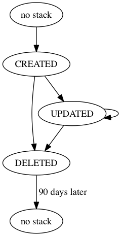
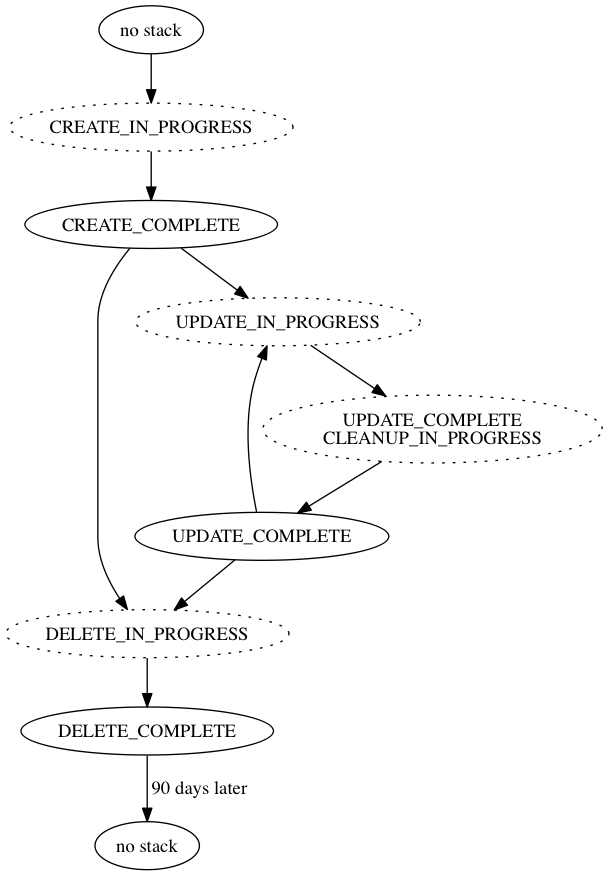
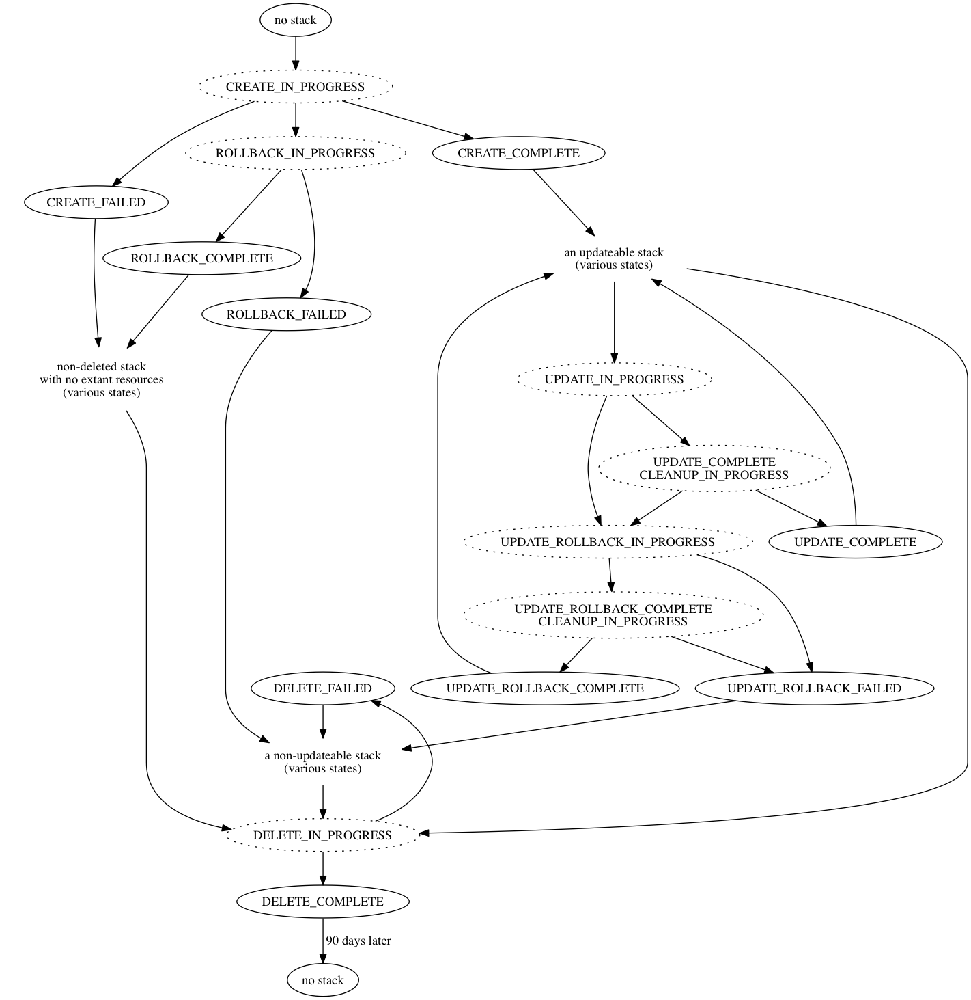
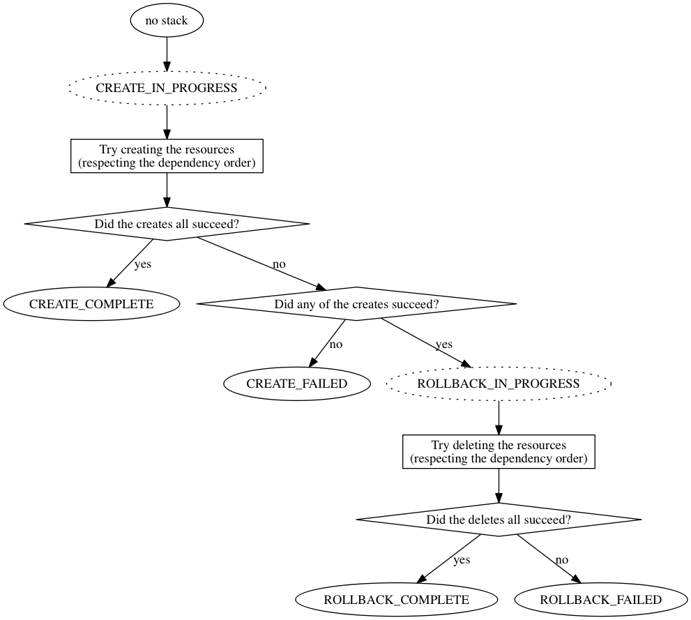
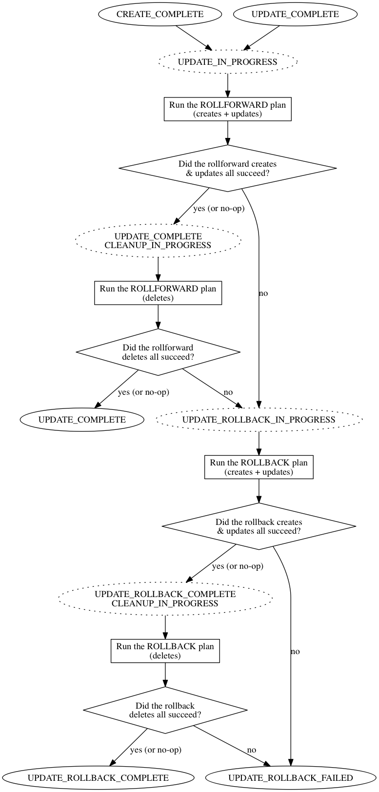
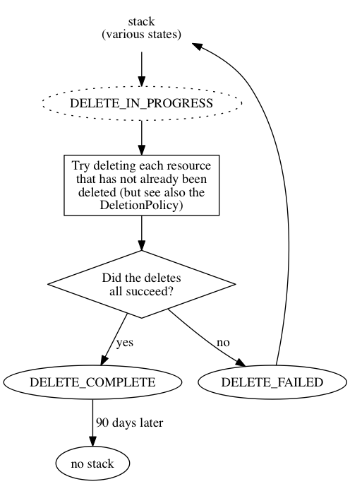

AWS CloudFormation Stack States
===============================

The [AWS CloudFormation documentation](http://docs.aws.amazon.com/AWSCloudFormation/latest/UserGuide/Welcome.html)
includes a [list of all the possible stack states](http://docs.aws.amazon.com/AWSCloudFormation/latest/UserGuide/using-cfn-describing-stacks.html):

 * `CREATE_COMPLETE`
 * `CREATE_IN_PROGRESS`
 * `CREATE_FAILED`
 * `DELETE_COMPLETE`
 * `DELETE_FAILED`
 * `DELETE_IN_PROGRESS`
 * `ROLLBACK_COMPLETE`
 * `ROLLBACK_FAILED`
 * `ROLLBACK_IN_PROGRESS`
 * `UPDATE_COMPLETE`
 * `UPDATE_COMPLETE_CLEANUP_IN_PROGRESS`
 * `UPDATE_IN_PROGRESS`
 * `UPDATE_ROLLBACK_COMPLETE`
 * `UPDATE_ROLLBACK_COMPLETE_CLEANUP_IN_PROGRESS`
 * `UPDATE_ROLLBACK_FAILED`
 * `UPDATE_ROLLBACK_IN_PROGRESS`

However, it does not make it clear how the states relate to each other.

This document aims to rectify that.

High-Level View
---------------

At a high level, the lifecycle of a stack is:

 * the stack initially does not exist;
 * the stack is created;
 * the stack is updated (0 or more times);
 * the stack is deleted;
 * the stack finally does not exist.

which you can visualise as follows:

However, "CREATED", "UPDATED" and "DELETED" are not real stack states – just a
simplified model.  So let's talk specifics.

The Happy Path
--------------

If we ignore all the error cases, the state diagram is as follows:

 * the stack initially does not exist;
 * the stack is created:
   * by first passing through `CREATE_IN_PROGRESS`
   * before coming to rest at `CREATE_COMPLETE`;
 * zero or more times, the stack is updated, where each update consists of:
   * first passing through `UPDATE_IN_PROGRESS`
   * then passing through `UPDATE_COMPLETE_CLEANUP_IN_PROGRESS`
   * before coming to rest at `UPDATE_COMPLETE`;
 * the stack is deleted:
   * by first passing through `DELETE_IN_PROGRESS`
   * before coming to rest at `DELETE_COMPLETE`;
 * the stack finally does not exist.

A couple of things to note here:

Firstly, each stack state can be considered either to be "in motion" (all the stacks named `..._IN_PROGRESS`), or "at rest" (everything else).

Secondly, note that once a stack has been deleted (`DELETE_COMPLETE`), the
stack remains present in AWS CloudFormation for the next 90 days, so that the
stack's metadata and events (log) can be inspected.  After 90 days, the stack
disappears from CloudFormation.

But: what about the error cases?

Error Handling
--------------

Let's complete the diagram by adding in all the states related to error
handling:

To make the diagram simpler, I've added a few "pseudo-states", to represent
abstract concepts like "a stack is updateable".  I've also assumed that some
of the states that *can* be passed through are (in a manner of speaking)
*always* passed through, even if the stack might spend zero time in that
state.

To break this down, let's look at how stacks are created, updated, and deleted.

Change Sets
-----------

Part of CloudFormation's job is to work out "how to get there from here" –
what resource creations, updates and deletes need to happen, and in what
order, to reach the requested outcome.  

The CreateStack, UpdateStack and DeleteStack API calls all make use of this
approach: validate the request, work out what changes will be required, then
make those changes.  The (Change Sets API
calls)[http://docs.aws.amazon.com/AWSCloudFormation/latest/UserGuide/using-cfn-updating-stacks-changesets.html]
can be used to inspect the planned changes before they are performed.

The changes always break down into:

 * 0 or more resource creates / updates;
 * followed by 0 or more resource deletions.

Some "updates" can be performed by updating the existing resources in-place;
some work by doing a create of a new resource, then deleting the old one.

If anything goes wrong, then CloudFormation may attempt to roll back to the
previous steady state.  This is done essentially by replaying the steps done
so far, but in reverse order, and with the sense of all the changes reverse
(create instead of delete, and vice versa).

CreateStack
-----------

For stack creation, the planned changes will always consist of resource
creations only (no updates, no deletes):

If anything goes wrong, then any resources that *were* created need to be
deleted (the `ROLLBACK_IN_PROGRESS` / `ROLLBACK_FAILED` / `ROLLBACK_COMPLETE`
states).

UpdateStack
-----------

UpdateStack is the most complex case, because it may include resource creates,
updates, and deletes.  And if anything goes wrong, this means that the
rollback too might involve deletes, updates, and creates:

DeleteStack
-----------

DeleteStack is reasonably straightforward; for each resource that is not
already deleted, and for which the
(DeletionPolicy)[http://docs.aws.amazon.com/AWSCloudFormation/latest/UserGuide/aws-attribute-deletionpolicy.html]
says to delete the resource, the resource deletion will be attempted.  In case
of problems, rollback (i.e. recreating resources) is *not* performed.

If there are problems, the stack goes to the `DELETE_FAILED` state.  Once the
reason for the deletion failure has been identified and fixed, `DeleteStack`
can be called again to re-try the deletion of any resources that have not yet
been deleted.

